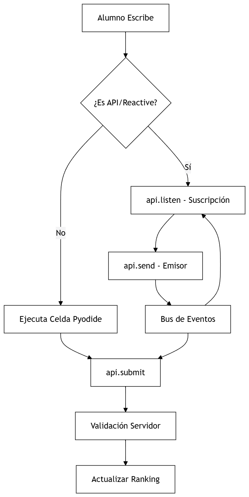

# Arquitectura del Sistema

CodeMaster utiliza un modelo de **ejecución distribuida local**. Cada celda de código es un entorno independiente (Worker) que procesa Python en el navegador del usuario.

## 1. El Bus de Eventos (`api`)
Para permitir comunicación entre celdas (Pub/Sub), hemos implementado la clase `__CodeMasterAPI`.

* **Send/Listen:** Implementa una cola de mensajes efímera.
* **Seguridad:** El `send` solo guarda el dato si existe un `listener` activo.
* **Atomicidad:** Al ejecutar una celda, el bus se limpia automáticamente (`__CodeMasterAPI._bus.clear()`) para evitar datos residuales de ejecuciones previas ("datos fantasma").

## 2. Diagrama de Flujo
```mermaid
graph TD
    A[Alumno Escribe] --> B{¿Es API/Reactive?};
    B -- No --> C[Ejecuta Celda (Pyodide)];
    B -- Sí --> D[api.listen - Suscripción];
    D --> E[api.send - Emisor];
    E --> F[Bus de Eventos];
    F --> D;
    C --> G[api.submit];
    F --> G;
    G --> H[Validación Servidor];
    H --> I[Actualizar Ranking];

    